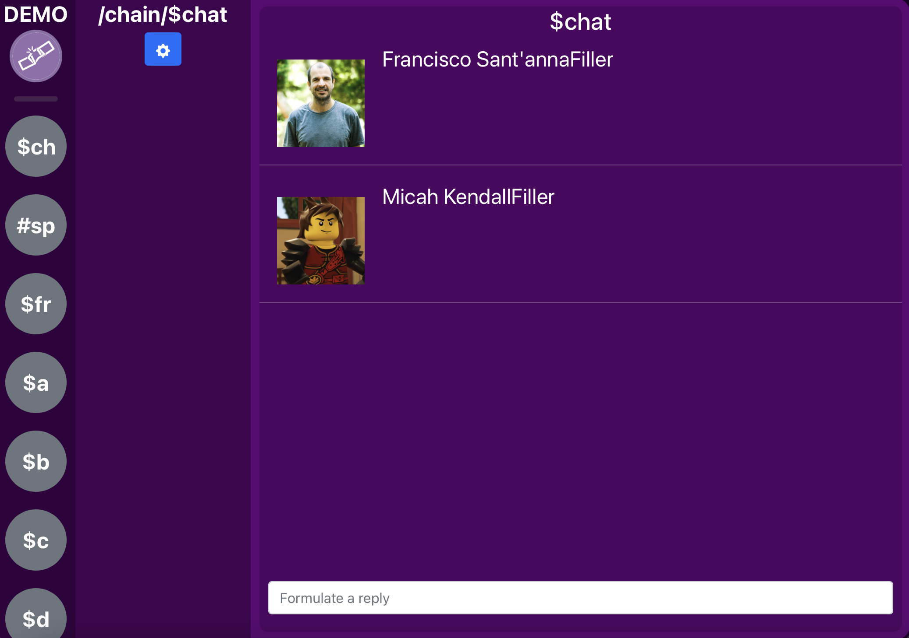
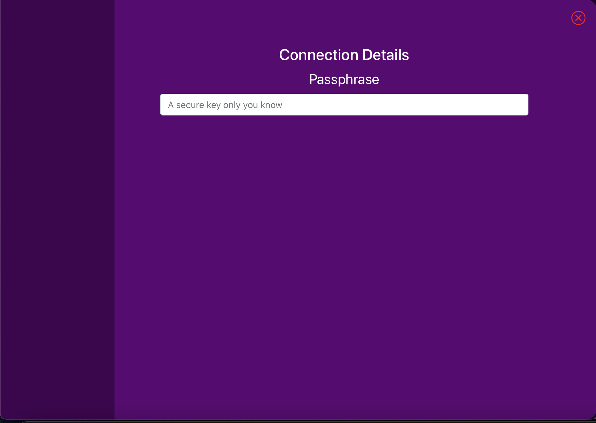
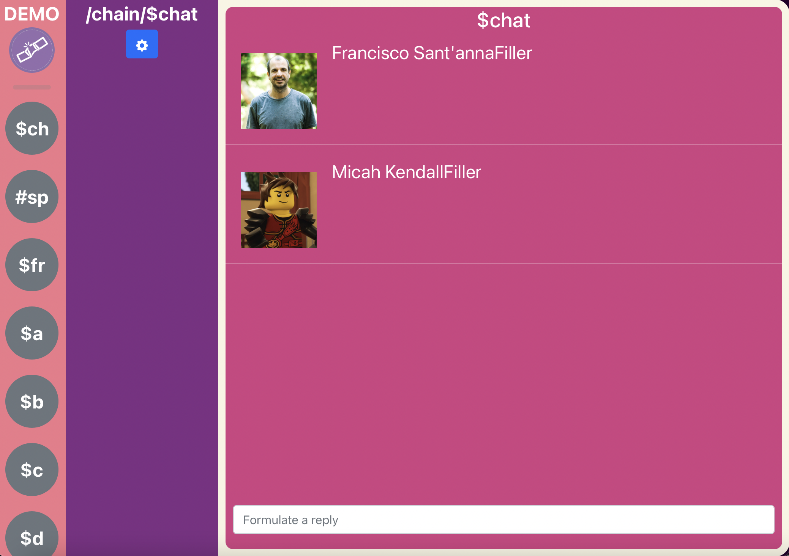

# Freechains web

## Archiving because I want to redesign.

1) I think a client should be embedded and have events emitted to js externally. Then, it can be wrapped in cross-platform builds like WebKit for MacOS, or Microsoft Edge WebView2 for Windows. This is better than implementing a daemon-interface in javascript.
2) I want to use material-ui instead of bootstrap. New MUI is better.
3) I'm overall better at react.

